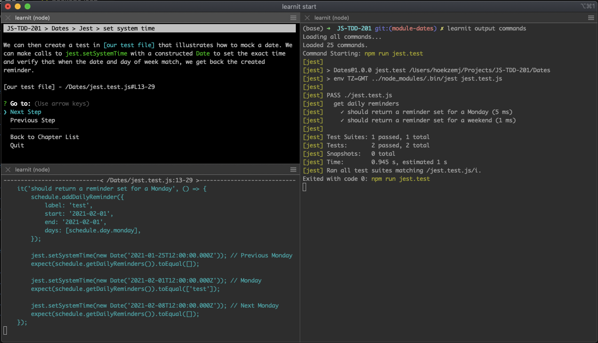

# Learn It

Idea: use version control to learn a topic.

## Installing

 - `npm install -g learnit`

## Course Structure

The structure of a course must currently follow this basic Layout:

```
Course
|-- Module 1
  |-- Chapter 01
    |-- Step 01
    |-- Step 02
  |-- Chapter 02
  |-- Summary
|-- Module 2
```

In reality, `Course` represents the `main` branch of a git repo, a module represents a
branch with the pattern `module-{module}`, a chapter represents a branch with the
pattern `{module}-chapter-{chapter}`, and a step represents a commit on a chapter branch.
There are particular commit messages that mark the starting and stopping commits of a
chapter.

## Taking a Course



You can take a course by cloning a repository created or meant to be read with Learn It.
Once you've cloned the repo, simply navigate to its top-level directory and run `learnit start`.

You may be encouraged to use up to 3 terminals, running `learnit output snippets` and
`learnit output commands` in the other 2 terminals so that you can view the course script,
code deltas and references, and commands the instructor has setup to run such as local servers,
installs, or tests running.

## TODO: What is to Come

For writers:

 - `learnit init` - completed, might need to have it initialize some more things though.
 - `learnit new module` - completed.
 - `learnit new chapter` - completed.
 - `learnit new step` - completed.
 - `learnit new command` - completed. Added background and single run commands.
 - `learnit update step` - completed.
 - `learnit revert step` - completed.
 - `learnit delete module` - completed. Need to delete config values.
 - `learnit delete chapter` - completed. Need to delete config values.
 - `learnit finish chapter` - completed.
 - `learnit summarize course` - completed, reader needs update.
 - `learnit summarize module` - completed, reader needs update.
 - `learnit summarize chapter` - completed, reader needs update.
 - `learnit goto main` - completed. May add confirmation of discarding changes.
 - `learnit goto module` - completed. ""
 - `learnit goto chapter` - completed. ""
 - `learnit list modules` - completed.
 - `learnit list chapters` - completed.
 - `learnit config` - completed.
 - `.learnitignore` - not started, eventually want multiple directory support, support module or chapter annotations
 - `.SCRIPT.md` - started, prompt when creating module, chapter, and step, associate with module (not called script, uses branch name), close to completed.
 - `learnit save` - completed.
 - `learnit upload` - mostly complete, needs to search for unpushed branches and set upstream references.
 - `learnit rebase` - not started, rebase all branches intelligently (for changes to `main` that need to be everywhere)
 - `learnit squash-scripts` - not started, collapses all changes to scripts to single commit so it does not change dynamically.

For consumers:

 - `learnit start`- mostly complete.
 - `learnit output` - mostly done, watches location and starts/stops commands as necessary, reporting their output
 - `learnit reset` - not started, erases all progress, resets to `main`
 - `learnit bookmark` - not started, allows user to set up a quick return point
 - `learnit annotate` - not started, allows user to save changes they made
 - `learnit settings` - started, allows user to configure setup, such as soft stepping so that deltas are visible to outside programs, collapse horizontal spacing, collapse vertical spacing, etc.
 - `learnit download` - rough draft complete, allows user to download courses and updates, synchronizes branch structure.
 - mark course/module/chapter as complete - started, have mechanism for keeping track of progress

For both:

 - contextual `help` - started, only render commands that are relevant to current situation
